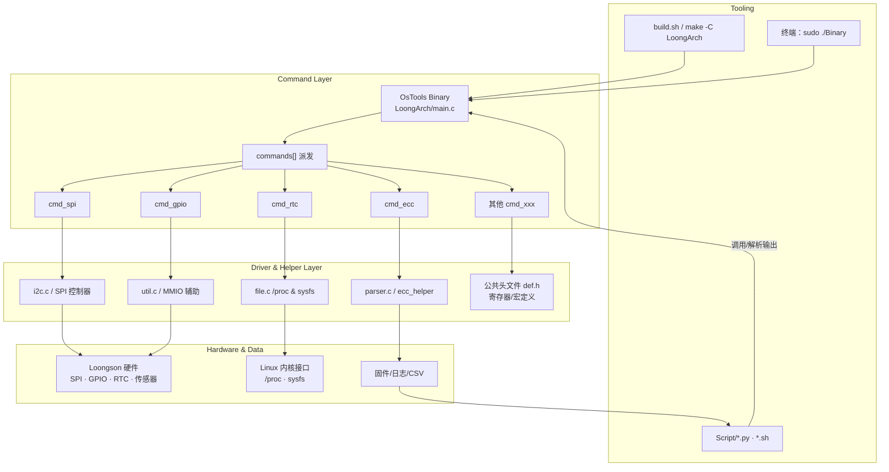

# OsTools

OsTools 是一套专为 Loongson（龙芯）平台设计的系统工具集，通过命令行子命令，支持硬件寄存器读取、固件更新、硬件状态检测等多种操作。核心功能基于 C 语言实现，配套 Python/Shell 脚本辅助数据处理和自动化运维。

## 架构总览



- **工具入口**：`build.sh`/`make` 产出二进制，终端与 `Script/` 脚本通过 `sudo ./Binary <command>` 调用统一的 `LoongArch/main.c`。
- **命令层**：`commands[]` 里的 `cmd_spi`、`cmd_gpio`、`cmd_rtc`、`cmd_ecc` 及其他 `cmd_xxx` 组合业务逻辑与参数解析。
- **驱动层**：`i2c.c`、`util.c`、`file.c`、`parser.c` 等抽象底层寄存器、I²C、/proc、日志解析，并共享 `def.h` 常量。
- **数据闭环**：驱动层把硬件与 OS 数据送回，脚本继续消费日志/CSV，形成由命令行触发、脚本分析的闭环。

## 安装说明

### 环境要求

- 支持 LoongArch 架构 Linux（部分兼容 MIPS64）
- 需预装 gcc、make
- Python 环境（部分脚本功能可选）
- 部分命令需 root 权限

### 依赖

- 编译依赖：GNU Make、GCC、git
- 脚本依赖（可选）：numpy、pandas、matplotlib、requests、beautifulsoup4

### 编译与安装

```bash
git clone https://github.com/MarsDoge/OsTools.git
cd OsTools
./build.sh
# 或手动 make -C LoongArch
sudo cp OsTools /usr/local/bin/   # 可选，加入 PATH
```

## 使用说明

OsTools 使用“主命令 + 子命令”的方式工作。直接运行 OsTools 将列出可用的子命令名称及简要说明。例如：

```bash
OsTools <command> [<args>]

All commands:
    conf       Config registers
    gpio       GPIO control
    rtc        Read or write RTC
    acpi       Read ACPI or Reboot
    spi        Read or write SPI flash
    pci        Scan PCI Bus
    ht         Read HT link registers
    mps        Read or write MPS (power regulator)
    spd        Read SPD (RAM info)
    fastboot   Read or set fastboot mode
    lcl        Check LCL (local cache/link)
    ecc        Check ECC (memory errors)
    avs        Adjust AVS (voltage)
    temp       Read temperature sensor

-h, --help        show this help message and exit  
-v, --version     show version
```

可以通过 `OsTools <命令> -h` 查看某个子命令的详细选项说明。例如，使用 spi 子命令的帮助：

```bash
OsTools spi -h
Usage: OsTools spi <args>

    -h, --help            show this help message and exit

Options:
    -r, --read            read LS7A SPI flash from address
    -u, --update          update LS3A SPI flash (写入更新固件)
    -d, --dump            dump the LS3A SPI flash (读取并保存固件)
    -g, --gmac            update GMAC flash (更新网卡 EEPROM)
    -t, --tcm             read LS7A TCM from address
    -s, --smbios          update SMBIOS (写入修改系统信息)

Arguments:
    -f, --file <path>     file path to read/write (读取/写入的文件路径)
    -a, --address <addr>  SPI controller PCI address (如 1fe001f0)
    -i, --id <int>        MAC ID (网卡编号)
    -m, --mac <addr>      MAC address (如 00:11:22:33:44:55)
    -c, --count <int>     read count (读取长度)
```

### 固件更新/备份示例

- **更新主板固件**  
  ```bash
  sudo OsTools spi -u -f LS3A50007A.fd
  ```

- **备份当前固件**  
  ```bash
  sudo OsTools spi -d -f backup_firmware.fd
  ```

## 项目结构

```text
OsTools/
├── LoongArch/             # C源代码目录，包含主程序和各子命令模块的实现  
│   ├── main.c             # 程序入口，解析全局命令和选项后分发子命令  
│   ├── def.h              # 全局宏和类型定义
│   ├── argparse.c/.h      # 命令行参数解析库
│   ├── gpio.c             # “gpio” 子命令实现
│   ├── rtc.c              # “rtc” 子命令实现
│   ├── acpi.c             # “acpi”子命令实现
│   ├── spi.c              # “spi” 子命令实现
│   ├── i2c.c              # I2C读写底层实现
│   ├── mps.c              # “mps” 子命令实现
│   ├── spd.c              # “spd” 子命令实现
│   ├── ht.c               # “ht” 子命令实现
│   ├── pci.c              # “pci” 子命令实现
│   ├── fastboot.c         # “fastboot” 子命令实现
│   ├── lcl.c              # “lcl” 子命令实现
│   ├── ecc（check_ecc.c） # “ecc” 子命令实现
│   ├── avs.c              # “avs” 子命令实现
│   ├── temp.c             # “temp” 子命令实现
│   ├── util.c             # 工具函数
│   └── ...                # 其他辅助源码文件
├── Script/                # 脚本工具目录
│   ├── c2c_csv.py         # 核间延迟热力图脚本
│   ├── FwReplyBot.py      # 固件邮箱自动回复机器人
│   ├── check_ecc.sh       # ECC 错误检测脚本
│   ├── check_ecc_out.sh   # ECC 检测输出解析脚本
│   └── ...                # 其他脚本
├── build.sh               # 一键编译脚本
├── LICENSE                # 开源许可证声明（GPL-2.0）
└── README.md              # 项目说明文档
```

## 贡献与支持

- 项目采用 GPLv2 协议开源
- 欢迎提交 Issue 或 Pull Request，反馈建议和贡献代码

## 持续集成

- `CI` 工作流会在每次推送或拉取请求时自动运行 `./build.sh`，确保 `LoongArch` 子模块可以在通用 Linux 环境中成功编译。
- 若需要调整构建选项，可在 `.github/workflows/ci.yml` 中更新所需的依赖或脚本。

---
